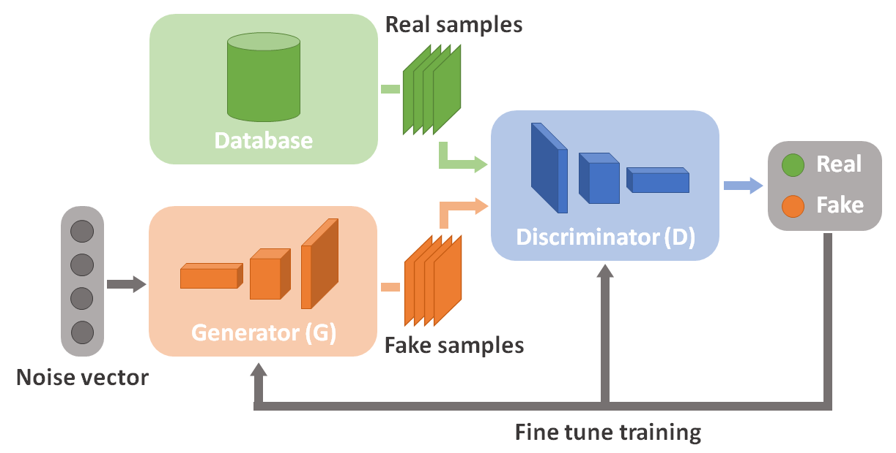
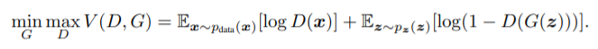
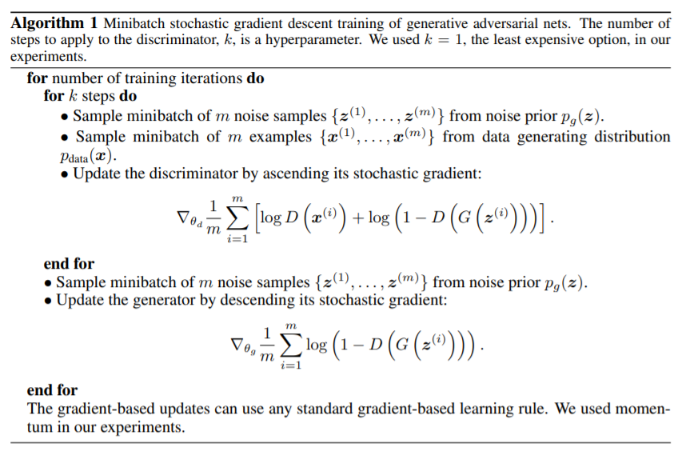
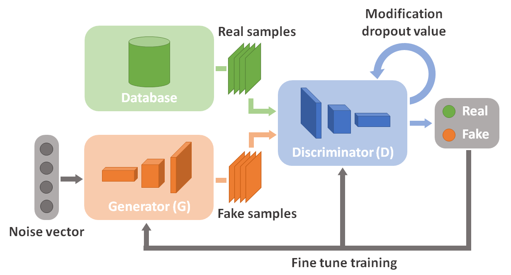

# AD-GAN

AD-GAN is a Generative Adversarial Network (GAN) architecture with an adaptive discriminator. It is based on DC-GAN architecture. With the use of Tensorflow 2.x.

## What is a GAN?
Generative Adversarial Networks (GANs) belong to the family of unsupervised learning algorithms. Their use was first introduced in 2014 by Ian Goodfellow and al. as part of work for the University of Montreal (https://arxiv.org/pdf/1406.2661.pdf). 

GANs are generative models. In their conception we find two neural networks placed in competition with one another. 

## How GAN works?

GANs are architectures with two competing neural networks. This should not allow either of the two neural networks to win. In game theory, we speak more precisely about a zero-sum game. Here is a diagram showing how it works:



A GAN works as follows. First, it is necessary to have a set of data. It is made of two neural networks: the first one has the role of generator; it has to generate a sample of data. The second one has a discriminator role, its objective is to detect whether a sample is the result of the generator or if it is part of the original sample. During training, the generator will learn to generate data that is the closest to the original dataset. As for the discriminating neural network, it will learn to detect whether a data sample which has been transmitted is true or not.

The theoretical functioning of a GAN is defined by the optimization of the function V(D,G), such as:



_Generative Adversarial Nets by Ian Goodfellow and al._

The first term corresponds to the maximization of the probability that the discriminator (D) detects that an element x belongs to a data sample. The second term corresponds to the maximization of the probability that the discriminator (D) detects an element generated by the generator (G).



_Generative Adversarial Nets by Ian Goodfellow and al._

The above pseudo-code explains the training of a GAN algorithm. The step of training by the descent of the stochastic gradient is separated between the generator and the discriminator.

## How AD-GAN works?

The AD-GAN's architecture suggests improving the performance of the discriminator against the generator. At the beginning of the training, the discriminator may be efficient and not allow the generator to converge. The idea of this architecture is to change the performance range of the discriminator to make it higher during learning. This range increases over time and makes it easier for the generator to converge.

There are several ways to make a discriminator evolve. The chosen approach is to keep the discriminator's structure and to play on the value of the dropout. Each layer of neurons has a dropout percentage. And this percentage decreases as the training progresses. It would have been possible to modify the structure of the discriminator in order to make it more efficient. Here is a diagram showing how AD-GAN works:



The AD-GAN model is designed so that the generator and the discriminator do not have to be implemented manually. They are generated from input images and some configurable hyperparameters. In addition, the range of values of the discriminator's dropout is also configurable with the start and end values as well as the step.

## Tree of project

Tree of AD-GAN project :

```
AD-GAN
├───ad_gan.py # Main file of the project
├───README.md
├───requirements.txt
│
├───dataset
│   └───dataset.py
│
├───gan # Directory and sub-directories are genereted during the first training
│   ├───checkpointsDiscriminator
│   │   └───model1 # Name of model
│   ├───checkpointsGenerator
│   │   └───model1
│   ├───imagesSample
│   │   └───model1
│   ├───model
│   │   └───model1
│   └───video
│       └───model1
│
├───gan_model
│   ├───discrimineur.py # Discriminator's architecture
│   ├───gan.py # GAN's architecture
│   └───generator.py # Generator's architecture
│
├───processing
│   └───processing_data.py # Tools for processing data
│
├───resources
│   ├───AD_GAN_architecture.png
│   ├───GAN_architecture.png
│   ├───GAN_mathematical_functioning_1.png
│   └───GAN_mathematical_functioning_2.png
│
├───run_gan
│   ├───gan_adaptive_discriminator.py # Training model of AD-GAN
│   └───use_gan_model.py # Using model of AD-GAN
│
└───utils
    ├───utils.py # Tools for the project
    └───utils_model.py # Tools for models
```

## Install

You need to use python 3.9.

If you need to create a virtual environment to clone the project:

` python3 -m venv AD_GAN_environment `

` source AD_GAN_environment/bin/activate `

` cd AD_GAN_environment `

Clone the repository :

` git clone https://github.com/TimLC/AD_GAN.git`

Install package requirements :

` pip install -r requirements.txt `

## How to run

To launch the learning of a new database of images, with a system for restoring training in the event of a shutdown. Use the following command:
```
python ad_gan.py
    --action trainAdGan # (Mandatory)
    --modelName model1 # (Mandatory) Model name.
    --imagesPath MNIST # (Mandatory) Set path of dataset images otherwise used two datasets are pre-implemented: MNIST and CIFAR10
    --batchSize 128 # Size of batch.
    --epochs 100 # Number of epochs.
    --sizeSeedGenerator 100 # Size of input vector for the generator.
    --addDenseLayersInDiscriminator 2 # Possibility to add additional layers to the discriminator, otherwise put None.
    --coefFiltersDiscriminator 128 # Multiplication coefficient of the number of discriminator filters.
    --addCon2dLayersInGenerator 2 # Possibility to add additional layers to the generator, otherwise put None.
    --coefFiltersGenerator 32 # Multiplication coefficient of the number of generator filters.
    --numberStepToSaveImage 10 # Number step after saving images.
    --numberStepToSaveModel 50 # Number step after saving model.
    --numberImagesToSave 9 # Number of images to save.
    --initialDropoutDiscriminator 0.5 # First value of dropout discriminator.
    --finalDropoutDiscriminator 0.0 # Last value of dropout discriminator.
    --stepDropoutDiscriminator 0.1 # Step of decreasing of the dropout discriminator.
    --rateLastDiscriminator 0.75 # Percentage of epochs for the last step of discriminator.
    --metricLossDiscriminator binary_crossentropy # Loss of discriminator model.
    --metricLossGan binary_crossentropy # Loss of GAN model.
```

NB : 

Once the model has been trained, you can modify the values of the generator input vector and see the effects on the generation, use the following command:

```
python ad_gan.py
    --action useAdGan # (Mandatory)
    --modelName model1 # (Mandatory) Name model.
    --stepDiscriminator 1 # (Mandatory) The number of the stepDisciminator you want to change.
    --step 0 # If you put a step value then it will be a model checkpoint that will be loaded.
```

To delete model:

```
python ad_gan.py
    --action deleteModelGenerated # (Mandatory)
    --modelName model1 # (Mandatory) Name of model to delete.
```

## Results

The AD_GAN model has been tested with famous databases of images. The following command is used to generate video from the training images:

```
python ad_gan.py
    --action generateVideo # (Mandatory)
    --modelName model1 # (Mandatory) Name of model.
```

### MINST database 

Learning on 60,000 images (training + test) of handwritten number of size 28 * 28 * 1:

### CIFAR10-cat database

Learning on 6000 images (training + test) of cat photos of size 32 * 32 * 3:

## Author

Created by **Timothé Le Chatelier** in **2021**

